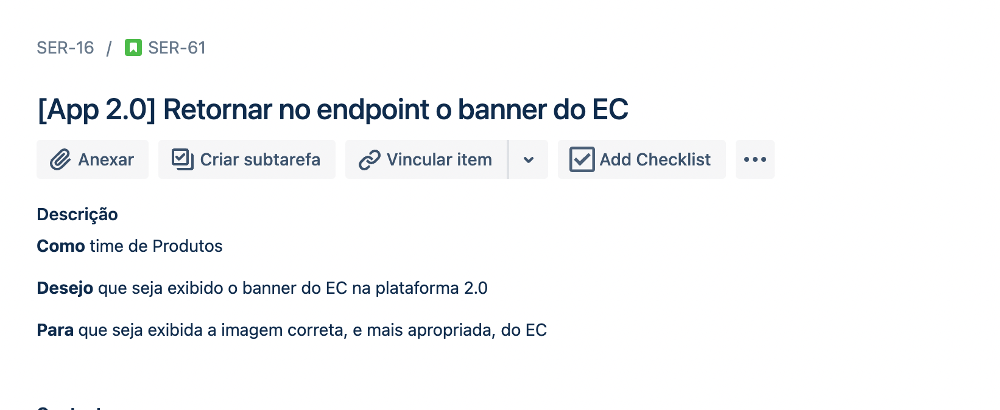

# Git Flow Pede Pronto

[Documentação git Flow](https://www.atlassian.com/git/tutorials/comparing-workflows/gitflow-workflow)

## Fluxo Pede Pronto 

Uma boa gestão de versionamento nos ajuda ter uma fluidez entre as tribos, e melhora o processo de 
deploy e testes das aplicações. 

### Branchs  
Iremos adotar como nomenclatura para a master de main.

A **develop** e a **main**, como no git flow são as principais. Sendo a
develop filha da main.

Toda **feature** é filha da **develop**, e temo como padrão de nomencalatura:
- feature/{Identicador do Jira da estória}
  

Ex.: feature/SER-61

    SER: squad Serviços Core

    61: numero da estória

Toda **hotfix** e **bugfix** são filhos da **main**, e temo como padrão de nomencalatura:

- hotfix/{Identicador do Jira da estória}
- bugfix/{Identicador do Jira da estória}

OBS: O merge precisa ser feito tanto na **main** quanto na **develop**
